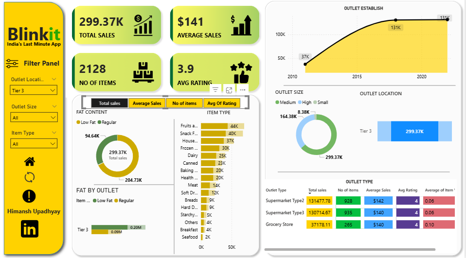
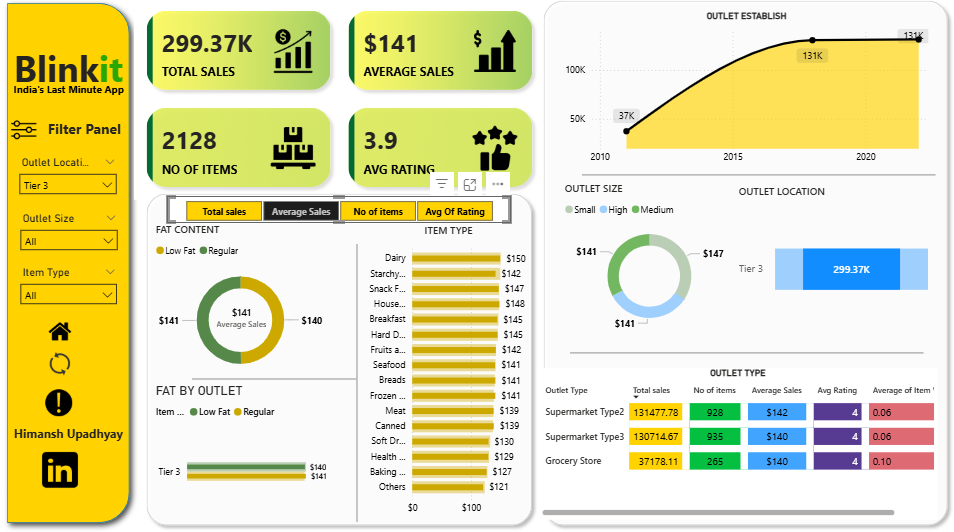
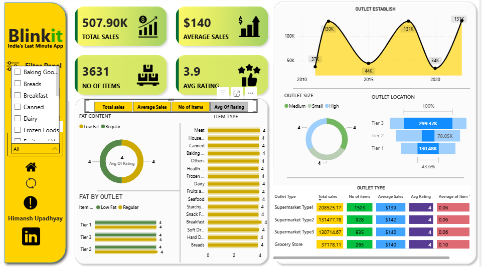

# 🛒 Blinkit Grocery Sales Dashboard (Power BI)

Created by: **Himansh Upadhyay**  
Tools: Power BI | Excel | Power Query | DAX | Data Modeling  

---

## 📊 Project Overview:

This interactive sales dashboard was built for Blinkit (India's Last-Minute Grocery App) to visualize and analyze key business metrics such as:

- 🏷️ **Total Sales**
- 📦 **Number of Items**
- 🌟 **Average Rating**
- 🏪 **Outlet Type & Location**
- 🧈 **Fat Content Distribution**
- ⏱️ **Sales Trends Over Time**

---

## 🔧 Tools & Skills Used:

| Tool         | Purpose                            |
|--------------|-------------------------------------|
| Power BI     | Dashboard design, DAX, visuals     |
| Excel        | Data cleaning and transformation    |
| SQL (offline) | Data querying and preparation      |
| Power Query  | ETL operations in Excel & Power BI |
| DAX          | Calculated measures and KPIs       |

---

## 📷 Dashboard Preview:

_Explore other views in the screenshots below:_

  

---

## 📁 Files in This Repository:

| File Name                                 | Description                             |
|-------------------------------------------|-----------------------------------------|
| `BlinkIT Grocery Data.xlsx`               | Cleaned Excel dataset                   |
| `Blinkit Dashboard by Himansh Upadhyay.pbix` | Power BI dashboard file                 |
| `2.png`, `3.png`, `9.png`                 | Dashboard visuals                       |

---

## 🔗 [Optional] Video Walkthrough
📺 Coming soon! *(Upload your YouTube link or Loom demo here)*

---

## 🙌 About the Creator

I’m a data analyst with 2+ years of real-world experience working with companies offline. I specialize in **Power BI**, **Excel**, **SQL**, and **Python** to extract, transform, and visualize business-critical data.

> 📬 Connect with me for freelance projects or job opportunities!

